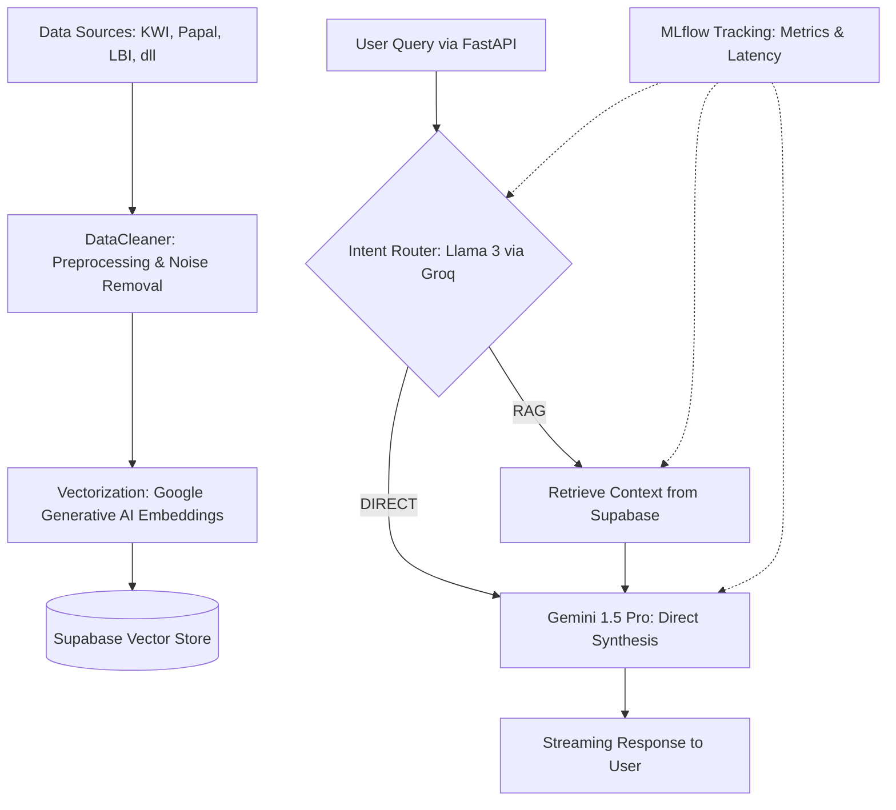

# Laporan Ujian Tengah Semester (UTS) - Proyek Data Mining (ST167)
**Universitas AMIKOM Yogyakarta**

---

## 1. Judul Proyek
**"Ecclesia-RAG (Verbum): Optimasi Information Retrieval pada Domain Teologi Katolik Menggunakan Agentic RAG dengan Arsitektur Hybrid LLM Orchestration"**

## 2. Latar Belakang
Pencarian informasi teologi Katolik yang akurat dan berbasis sumber resmi (seperti dokumen magisterium, ensiklik paus, dan Kitab Hukum Kanonik) seringkali menghadapi kendala dalam hal relevansi dan kemudahan akses. Sistem pencarian konvensional yang berbasis kata kunci (*keyword-based search*) sering kali tidak mampu memahami konteks semantik dari dokumen-dokumen yang kompleks tersebut, sehingga rentan menghasilkan informasi yang kurang tepat.

Oleh karena itu, proyek "Ecclesia-RAG (Verbum)" diusulkan sebagai solusi dengan menerapkan pendekatan *Agentic Retrieval-Augmented Generation* (RAG). Pendekatan ini memanfaatkan arsitektur *Hybrid LLM Orchestration*, di mana sebuah model bahasa berkecepatan tinggi (seperti Llama 3 yang diakses melalui Groq) bertindak sebagai *intent router* untuk membedakan pertanyaan kasual dengan pertanyaan teologis yang memerlukan pencarian dokumen. Selanjutnya, model bahasa yang lebih komprehensif (seperti Gemini 1.5 Pro) digunakan sebagai *synthesizer* untuk menyusun jawaban akhir berdasarkan konteks dokumen paling relevan yang ditarik dari *vector database*. Hal ini mengoptimalkan proses *information retrieval* dengan memastikan bahwa jawaban yang diberikan memiliki dasar sumber dokumen gerejawi yang kuat, terverifikasi, serta meminimalisir risiko halusinasi informasi.

## 3. Diagram Alur
Berikut adalah diagram alur (*flowchart*) dari sistem "Ecclesia-RAG", mulai dari pemrosesan data historis hingga di-serve ke pengguna:



## 4. Analisa Kode
Berdasarkan hasil analisa dari *workspace* proyek, berikut adalah snippet kode yang membentuk fungsionalitas inti:

### a. Preprocessing Data (`src/processors/cleaner.py`)
```python
    def clean_text(self, text: str, source_type: str = "general") -> str:
        # ...
        patterns = self.noise_patterns.get(source_type, [])
        if source_type == "general":
            patterns = self.noise_patterns["imankatolik"]

        for pattern in patterns:
            text = re.sub(pattern, "", text, flags=re.IGNORECASE | re.DOTALL)
        
        text = re.sub(r'\s+', ' ', text)
        return text.strip()
```
**Analisis Teknis:** 
Fungsi `clean_text` adalah komponen krusial dalam tahap pra-pemrosesan (*preprocessing*). Berdasarkan identifikasi sumber asal dokumen (misal: "kwi", "papal", "lbi"), sistem memanggil serangkaian *Regular Expression* (RegEx) spesifik yang didefinisikan pada atribut `noise_patterns`. Ekspresi ini akan secara otomatis membersihkan elemen sisa penarikan data (*scraping noise*) seperti teks navigasi, tombol antarmuka web, tanggal rilis, dan hak cipta. Hal ini memastikan hanya teks esensial (konten doktrin/berita) yang masuk ke dalam *vector database*, yang sangat menunjang akurasi kosinus-similaritas (*cosine similarity*) saat tahap penarikan data.

### b. Modelling & Agentic Logic (`src/orchestrator/agent_logic.py`)
```python
    def route_intent(self, query: str) -> str:
        system_prompt = """You are an intent router for a Catholic Theology AI assistant.
Analyze the user's query and output EXACTLY ONE of the following routing labels:
- RAG: If the query asks for Catholic teachings...
- DIRECT: If the query is a simple greeting..."""
        # ...
        response = self.intent_router.invoke(messages)
        intent = response.content.strip().upper()
        if "RAG" in intent:
            return "RAG"
        return "DIRECT"
```
**Analisis Teknis:** 
Kode ini mengimplementasikan pola arsitektur *Agentic Routing*. Menggunakan model Llama 3 (diinisialisasi melalui Groq API yang memiliki inferensi sangat cepat), sistem mengklasifikasikan pertanyaan masuk (*user query*) ke dalam kategori `RAG` atau `DIRECT`. Pendekatan ini menghadirkan efisiensi sumber daya secara signifikan; hanya pertanyaan yang membutuhkan analisis doktrin yang akan memicu eksekusi *vector search* (RAG), sedangkan sapaan umum akan langsung dijawab (DIRECT). Mekanisme ini memangkas ongkos komputasi serta meminimalisir latensi.

### c. Evaluasi Performa dan MLflow (`src/orchestrator/agent_logic.py`)
```python
    async def retrieve_context(self, query: str, k: int = 5) -> str:
        if not self.vector_store: return ""
        
        start_time = time.time()
        docs = self.vector_store.similarity_search(query, k=k)
        retrieval_latency = time.time() - start_time
        
        # Log metric to MLflow
        if self.mlflow_uri and mlflow.active_run():
            mlflow.log_metric("retrieval_latency", retrieval_latency)
```
**Analisis Teknis:** 
Cuplikan ini menunjukkan integrasi *Machine Learning Operations* (MLOps) menggunakan `mlflow`. Pada saat proses penarikan teks (*retrieval*) berjalan, sistem menangkap durasi waktu yang dibutuhkan oleh Supabase Vector Store. Metrik `retrieval_latency` ini kemudian dikirim ke server *tracking* MLflow/DagsHub secara *real-time*. Dalam pelaksanaannya, pelacakan metrik seperti ini sangat penting untuk mitigasi anomali sistem—sebagai contoh, apabila terdapat isu berupa *"Hardware Bottleneck on High-Dimensional Dependency Resolution"* pada lingkungan sistem operasi (seperti CachyOS), log eksekusi ini akan memfasilitasi visibilitas yang dibutuhkan untuk mengidentifikasi hambatan latensi dari pencarian *vector* versus performa *embedder*.

## 5. Deployment
Analisis terhadap komponen *User Interface* (UI) menunjukkan bahwa proyek saat ini mengadopsi prinsip *decoupled architecture* (pemisahan bagian *frontend* dan *backend*). Tidak ditemukan skrip tunggal monolitik layaknya Streamlit (`app.py`) atau Next.js Vercel (`page.tsx`) di *root* direktori maupun `src`. Alih-alih, layanan disalurkan (*deployed*) secara murni melalui sebuah antarmuka pemrograman aplikasi (API) *backend* menggunakan **FastAPI** (`src/api/server.py`). 

Layanan FastAPI ini mengemban fungsionalitas inti proyek yang membuka konfigurasi jalur jaringan (*endpoint*) `/ask` di port lokal `8000`. Antarmuka ini mengembalikan sebuah instrumen penyaluran teks dinamis (*StreamingResponse*), merespons panggilan generator dari *HybridOrchestrator*. Struktur peladen semacam ini memberikan nilai strategis yang sangat tinggi karena membuat model RAG sepenuhnya terisolasi dan "*framework-agnostic*". Konsekuensinya, integrasi tingkat lanjut—baik dihubungkan ke aplikasi *chat* antarmuka berbasis Streamlit, dasbor interaktif dengan Next.js, hingga aplikasi *mobile*—dapat dibangun dan disesuaikan tanpa mengubah satu baris pun komponen fundamental mesin analis AI.
